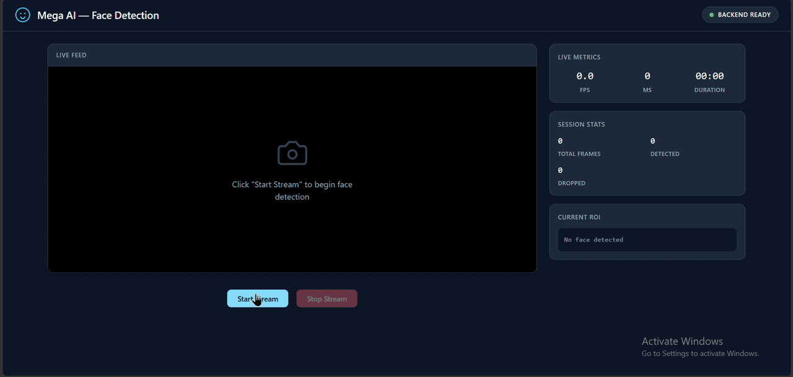

# Mega AI - Real-Time Face Detection Video Streaming System

## Overview
Containerized backend API that accepts a video feed, detects faces without OpenCV, stores ROIs in PostgreSQL, and streams annotated video to a React frontend.

> **Note on OpenCV**: The assignment requires drawing the ROI without using the OpenCV Python library (`cv2`). Our application code uses **Pillow** (`PIL.ImageDraw`) exclusively for drawing bounding boxes. MediaPipe (our face detection library) installs `opencv-contrib-python` as an internal transitive dependency for its own image processing, but our code never imports or uses `cv2` for frame manipulation or drawing.

## Architecture

```
┌─────────────┐      WebSocket/HTTP      ┌─────────────────┐
│   React.js  │ ◄──────────────────────► │   FastAPI App   │
│  Frontend   │   (video stream + ROI)   │   (Python)      │
└─────────────┘                          └────────┬────────┘
                                                  │
                                         ┌────────▼────────┐
                                         │   PostgreSQL    │
                                         │   (store ROIs)  │
                                         └─────────────────┘
```

## Live Deployment

| Service | URL |
|---------|-----|
| Frontend | **https://mega-ai-realtime-facedetect-frontend.onrender.com** |
| Backend API | **https://mega-ai-realtime-facedetect.onrender.com** |
| API Docs | `https://mega-ai-realtime-facedetect.onrender.com/docs` |



## Quick Start

### Prerequisites
- Docker & Docker Compose
- Git

### Run Locally
```bash
git clone https://github.com/iamsankeerth/mega-ai-realtime-facedetect.git
cd mega-ai-realtime-facedetect
docker-compose up --build
```

The app will be available at `http://localhost:13000` (frontend) and `http://localhost:18000` (backend API docs at `/docs`).

## API Endpoints

| Method | Endpoint | Description |
|--------|----------|-------------|
| WebSocket | `/streams/{stream_id}/ingest` | Receive real-time JPEG frames from camera |
| GET | `/streams/{stream_id}/video` | Stream annotated MJPEG with ROI overlay |
| GET | `/streams/{stream_id}/rois` | Get ROI data (bounding boxes) per frame |

## Tech Stack
- **Backend**: Python, FastAPI, MediaPipe (face detection), Pillow (ROI drawing — no OpenCV), SQLAlchemy, asyncpg
- **Frontend**: React.js, Vite, HTML5 Canvas/WebSocket
- **Database**: PostgreSQL
- **Infrastructure**: Docker, Docker Compose

## AI Collaboration Attestation
AI assistants were used for architectural guidance, debugging, and code review during development.

## License
MIT
